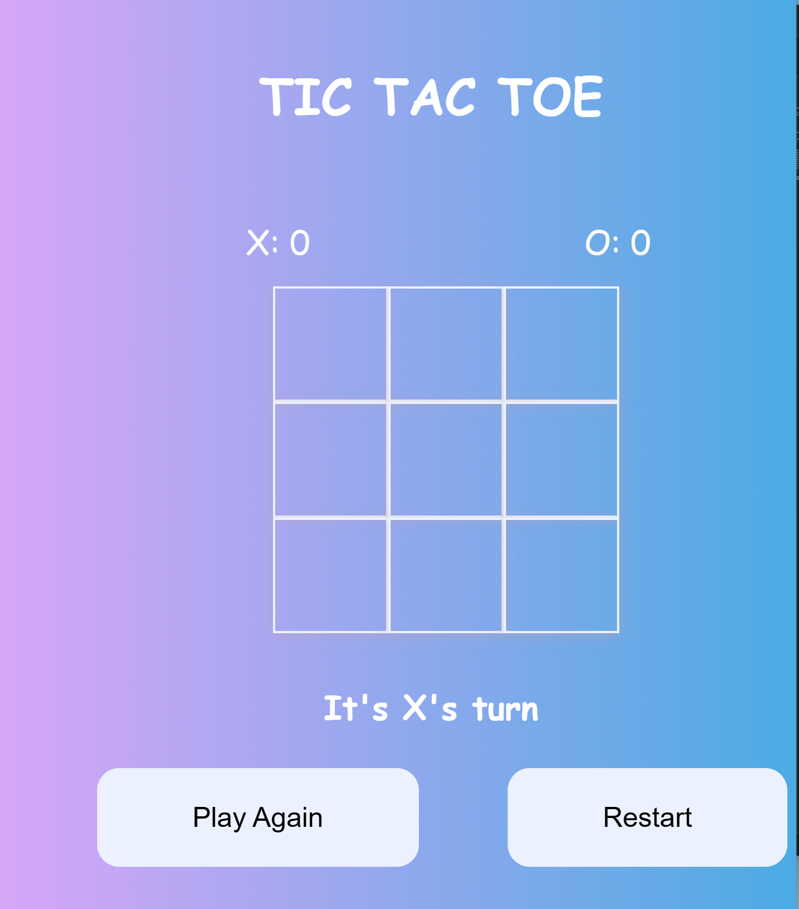

# TIC-TAC-TOE GAME
This is the screenshot for TIC TAC TOE Game.

## How to play
1,Open this [link](https://kaliamdie.github.io/TIC-TAC-TOE-GAME/) in your web browser.  
2,The game board will be shown with 9 empty cells.  
3, Players take turns clicking on the empty cells to put their Mark(X or O).  
4,The game is to get three of your marks in a row,either horizontally,vertically or diagonally.  
5,the game wil display the status of the player on the bottom and it track the points of the player's on the top.  
6,If one of the player wins it show the winnning player's mark,showing the points, and it will display a color on the cell.  
7,If there is no winner that means if there is no empty cell,the game will ends in a draw.  
8,The game has two buttons one for playing again  without removing the points and the restart button to start a new game.  

## Languages
- HTML
- CSS
- JavaScript(DOM Manipulation)

### Resources
- stack overflow
- superdesiner.co
- pixbay(sound effects)
- freeCodeCamp

## File Structure
- index.html: The main HTML file containing the game structure and elements.
- style.css: The CSS file for styling the game interface.
- app.js: The JavaScript file with the game logic and functionality.
- click.mp3: Sound effect file for clicking on a cell.
- mouse.mp3: Sound effect file for winning the game.
- game.wav: Sound effect file for game over.
## link
[click here ](https://kaliamdie.github.io/TIC-TAC-TOE-GAME/) `if you want to check out the link to play this game.`
